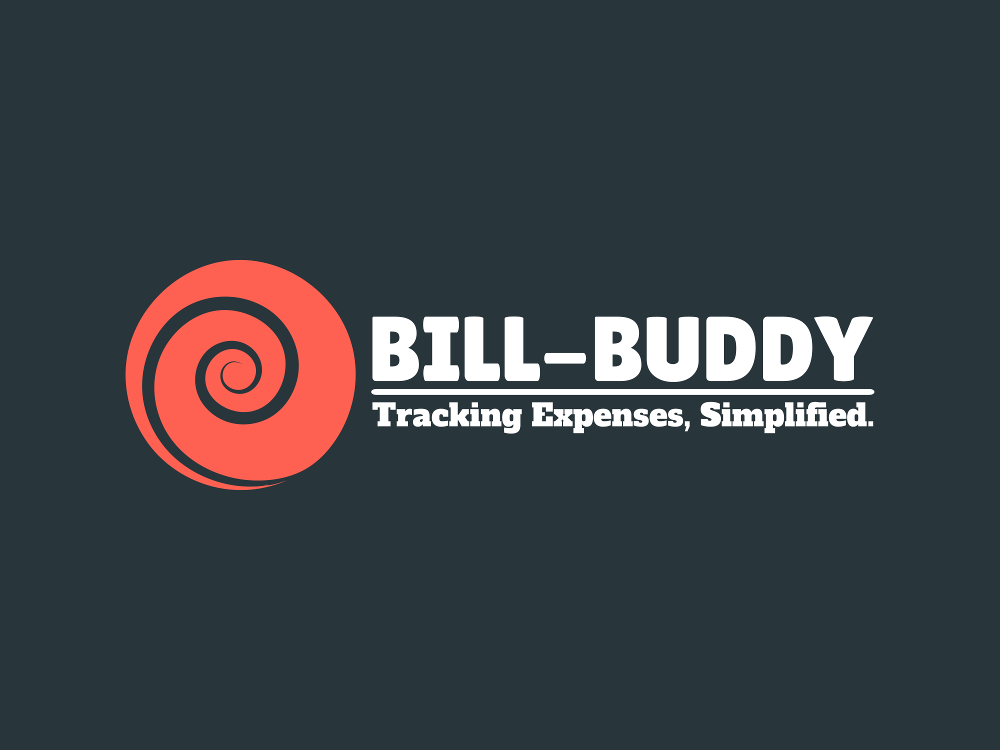

# BillBuddy Expense Tracker App

 <!-- You can add your project logo here -->

BillBuddy-Expense-Tracker-App is a full-stack MERN application that helps you keep track of your expenses. With support for all CRUD operations, this app allows you to easily add, edit, and delete expenses. The app is built using the popular ANT design library, providing a sleek and modern user interface. Keep your finances in check with BillBuddy-Expense-Tracker-App!
## Features

- Add new expenses with details like name, category, amount, and reference.
- View a list of all expenses.
- Update or edit existing expenses.
- Delete expenses when they are no longer needed.
- User-friendly interface with ANT Design components.

## Technologies Used

- MongoDB: Store and manage expense data.
- Express.js: Backend server and API endpoints.
- React.js: Frontend user interface.
- Node.js: Backend server environment.
- ANT Design: UI components for a polished look and feel.

## Getting Started

### Prerequisites

- Node.js and npm installed.
- MongoDB database setup.

### Installation

1. Clone the repository:
   ```bash
   git clone [URL-of-the-repository]
   ```
2. Navigate to the project directory:
   ```bash
   cd BillBuddy-Expense-Tracker-App
   ```
3. Install dependencies for both the server and client:
   ```bash
   npm install
   cd client
   npm install
   ```
4. Start the development server:
   ```bash
   cd ..
   npm run dev
   ```
